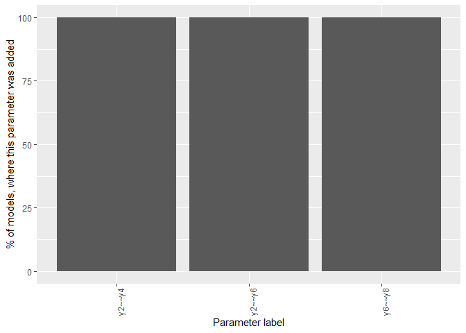

<!-- README.md is generated from README.Rmd. Please edit that file -->

# semmi

> **Warning**: This project is experimental and should **not** be use
> for publications.

Fitting structural equation models is hard. Most models do not fit well
and post-hoc respecification with modification indices is a common
practice. This practice has been criticized for capitalization on chance
(see [MacCallum et al.,
1992](https://psycnet.apa.org/doi/10.1037/0033-2909.111.3.490)). That
is, the model may adapt too closely to the data and start fitting noise.

**semmi** is an R package building on [**lavaan**](https://github.com/yrosseel/lavaan) 
that provides bootstrapping and resampling methods for model re-specification with
modification indices. The objective is to make specification search less
dependent on the sample, that is, to improve the stability. Importantly,
this is still an exploratory method and the SEM is no longer
confirmatory.

In bootstrapped specification search, random samples are drawn from the
original data set. These samples have the same size as the original
data, but may contain subjects multiple times. The function
`bootstrap_specification_search` will apply specification search to each
of the samples and return the number of times a specific modification
has been added to the model.

In resampled specification search, random samples are drawn from the
original data set. These samples have a smaller size than the original
data and each subject may be present once or not at all in the subset.
The function `resample_specification_search` will apply specification
search to each of the samples and return the number of times a specific
modification has been added to the model.

**semmi** is inspired by stability selection used in regularized SEM
(see Li & Jacobucci 2021; Meinshausen & Bühlmann, 2010). The procedure
is, to some degree, also similar to that used in gimme (Gates &
Molenaar; 2012).

- Gates, K. M., & Molenaar, P. C. M. (2012). Group search algorithm
  recovers effective connectivity maps for individuals in homogeneous
  and heterogeneous samples. NeuroImage, 63(1), 310–319.
  <https://doi.org/10.1016/j.neuroimage.2012.06.026>
- Li, X., & Jacobucci, R. (2021). Regularized structural equation
  modeling with stability selection. Psychological Methods, 27(4),
  497–518. <https://doi.org/10.1037/met0000389>
- Meinshausen, N., & Bühlmann, P. (2010). Stability selection. Journal
  of the Royal Statistical Society: Series B (Statistical Methodology),
  72(4), 417–473. <https://doi.org/10.1111/j.1467-9868.2010.00740.x>

## Installation

You can install the development version of **semmi** as follows:

``` r
if(!require(devtools)) install.packages("devtools")
devtools::install_github("jhorzek/semmi")
```

## Example

``` r
# The following example is adapted from ?lavaan::sem
library(semmi)
set.seed(123)

model <- '
  # latent variable definitions
     ind60 =~ x1 + x2 + x3
     dem60 =~ y1 + a*y2 + b*y3 + c*y4
     dem65 =~ y5 + a*y6 + b*y7 + c*y8

  # regressions
    dem60 ~ ind60
    dem65 ~ ind60 + dem60

  # residual correlations
  # none specified -> we want to use specification
  # search to check for residual correlations
'

fit <- sem(model, data = PoliticalDemocracy)
spec_searched <- resample_specification_search(model = model,
                                               data = PoliticalDemocracy,
                                               operators = "~~",
                                               N_subsets = 70,
                                               number_of_resamples = 5) # should be much higher!
plot(spec_searched)
```


